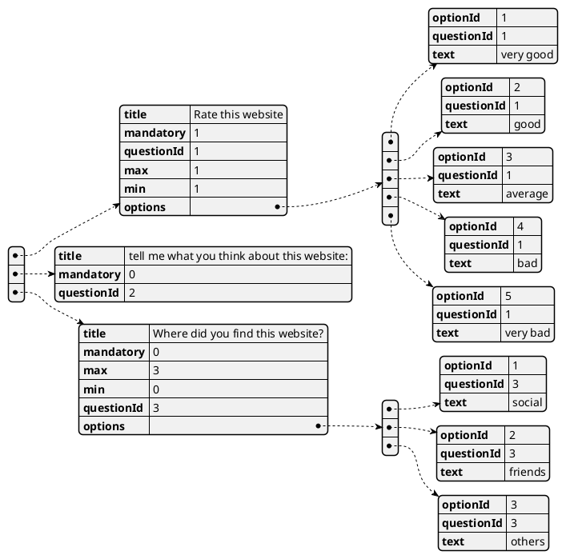
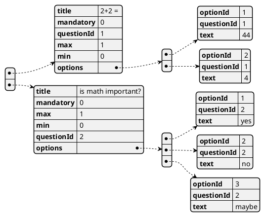
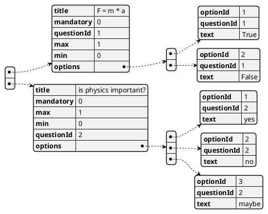
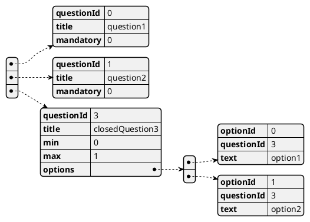
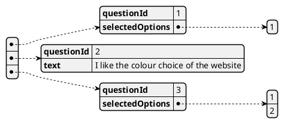
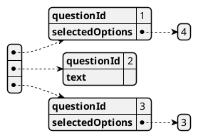
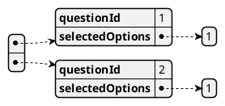
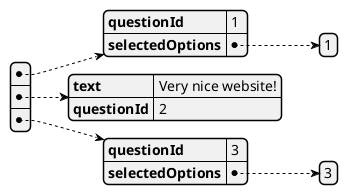

# Exam #1: "Survey"
## Student: s280169 RIOLA MATTIA 

## React Client Application Routes

- Route `/`: 
  - List of all surveys if user (visitor) is not logged in
  - List of the surveys of the logged in user (admin)
- Route `/survey/:survey_id`: 
  - if the user is logged in (admin)
    - The answers of the survey id specified by the param
  - if the user is not logged in (visitor)
    - list of questions of the survey (the visitor can reply and submit the answers of the surveys)
- Route `/login`: Login form
- Route `/newSurvey`: Form to add a new Survey by an admin

## API Server

- POST `/api/login`
  - request body 
  ```json
  {"username":"admin@mail.com","password":"password"}
  ```
  - response code
    - 200 OK 
    - 401 Unauthorized
- DELETE `/api/sessions/current`
  - response 
    - 200 OK
- GET `/api/sessions/current`
  - response
    - 200 OK
    - 401 Unauthorized
- GET `/api/allSurveys`
  - response
    - 404 Not found
    - 500 Internal server error
    - 200 OK
      - body example:
  ```json
  [{"survey_id":1,"user_id":1,"title":"website satisfaction","questions":[{"title":"Rate this website","mandatory":1,"questionId":1,"max":1,"min":1,"options":[{"optionId":1,"questionId":1,"text":"very good"},{"optionId":2,"questionId":1,"text":"good"},{"optionId":3,"questionId":1,"text":"average"},{"optionId":4,"questionId":1,"text":"bad"},{"optionId":5,"questionId":1,"text":"very bad"}]},{"title":"tell me what you think about this website:","mandatory":0,"questionId":2,"surveyId":1},{"title":"Where did you find this website?","mandatory":0,"max":3,"min":0,"questionId":3,"options":[{"optionId":1,"questionId":3,"text":"social"},{"optionId":2,"questionId":3,"text":"friends"},{"optionId":3,"questionId":3,"text":"others"}]}],"answers_number":4},{"survey_id":2,"user_id":3,"title":"math quiz","questions":[{"title":"2+2 = ","mandatory":0,"questionId":1,"max":1,"min":0,"options":[{"optionId":1,"questionId":1,"text":"44"},{"optionId":2,"questionId":1,"text":"4"}]},{"title":"is math important?","mandatory":0,"max":1,"min":0,"questionId":2,"options":[{"optionId":1,"questionId":2,"text":"yes"},{"optionId":2,"questionId":2,"text":"no"},{"optionId":3,"questionId":2,"text":"maybe"}]}],"answers_number":0},{"survey_id":3,"user_id":3,"title":"physics quiz","questions":[{"title":"F = m * a ","mandatory":0,"questionId":1,"max":1,"min":0,"options":[{"optionId":1,"questionId":1,"text":"True"},{"optionId":2,"questionId":1,"text":"False"}]},{"title":"is physics important?","mandatory":0,"max":1,"min":0,"questionId":2,"options":[{"optionId":1,"questionId":2,"text":"yes"},{"optionId":2,"questionId":2,"text":"no"},{"optionId":3,"questionId":2,"text":"maybe"}]}],"answers_number":1},{"survey_id":4,"user_id":1,"title":"Some name","questions":[{"questionId":0,"title":"My open question mandatory","mandatory":1},{"questionId":1,"title":"ollalla","min":1,"mandatory":1,"max":1,"options":[{"optionId":0,"text":"ollalla"},{"optionId":1,"text":"ollallla"},{"optionId":2,"text":"laaaa"}]}],"answers_number":0},{"survey_id":5,"user_id":1,"title":"titolo qualcosa","questions":[{"questionId":0,"title":"ciao","min":1,"mandatory":1,"max":4,"options":[{"optionId":0,"text":"option 1"},{"optionId":1,"text":"2"},{"optionId":2,"text":"3"},{"optionId":3,"text":"4"}]}],"answers_number":1}]
  ```
- GET `/api/yourSurveys`
  - response
    - 404 Not found
    - 500 Internal server error
    - 200 OK
      - body example:
  ```json
  [{"survey_id":2,"user_id":3,"title":"math quiz","questions":[{"title":"2+2 = ","mandatory":0,"questionId":1,"max":1,"min":0,"options":[{"optionId":1,"questionId":1,"text":"44"},{"optionId":2,"questionId":1,"text":"4"}]},{"title":"is math important?","mandatory":0,"max":1,"min":0,"questionId":2,"options":[{"optionId":1,"questionId":2,"text":"yes"},{"optionId":2,"questionId":2,"text":"no"},{"optionId":3,"questionId":2,"text":"maybe"}]}],"answers_number":0},{"survey_id":3,"user_id":3,"title":"physics quiz","questions":[{"title":"F = m * a ","mandatory":0,"questionId":1,"max":1,"min":0,"options":[{"optionId":1,"questionId":1,"text":"True"},{"optionId":2,"questionId":1,"text":"False"}]},{"title":"is physics important?","mandatory":0,"max":1,"min":0,"questionId":2,"options":[{"optionId":1,"questionId":2,"text":"yes"},{"optionId":2,"questionId":2,"text":"no"},{"optionId":3,"questionId":2,"text":"maybe"}]}],"answers_number":1}]
  ```
- `/api/survey/:id`
  - request params:
    - id: id of the survey
  - response
    - 404 Not found
    - 500 Internal server error
    - 200 OK
 - `/survey/api/sendAnswers`
   - request body:
     - answers json example:
```json
{"answers":[{"questionId":1,"selectedOptions":[1]},{"text":"My Answer is this one","questionId":2},{"questionId":3,"selectedOptions":[1,2]}],"surveyId":1,"visitorName":"VisitorName"}
```
  - response
    - 500 Internal server error
    - 200 OK
- `/api/sendNewSurvey`
  - request
    - body survey json example:
```json
{"title":"My new survey","questions":[{"questionId":0,"title":"my question Title","mandatory":0},{"questionId":1,"title":"My closed question","min":0,"mandatory":0,"max":1,"options":[{"optionId":0,"text":"option1"},{"optionId":1,"text":"option2"}]}]}
```
- response
    - 500 Internal server error
    - 200 OK


## Database Tables

- Table `users` - contains user_id email username password

| user_id | email                  | username | password  |
| ------- | ---------------------- | -------- | --------- |
| 1       | admin@mail.com         | admin    | password  |
| 2       | riola.mattia@gmail.com | Mattia   | mattia    |
| 3       | teacher@polito.com     | Teacher  | teacher30 |

-----

- Table `surveys` - contains survey_id user_id title questions answers_number

| survey_id | user_id | title                | questions               | answers_number |
| --------- | ------- | -------------------- | ----------------------- | -------------- |
| 1         | 1       | website satisfaction | json object (see below) | 3              |
| 2         | 3       | math quiz            | json object (see below) | 0              |
| 3         | 3       | physics quiz         | json object (see below) | 1              |


  - 'Website satisfaction' `questions` :  

 - 'math quiz' `questions` :

 - 'physics quiz' `questions` :


----

- Table `answers` - contains answer_id survey_id name answers

| answer_id | survey_id | name                   | answers                 |
| --------- | --------- | ---------------------- | ----------------------- |
| 1         | 1         | Mario                  | json object (see below) |
| 2         | 1         | Luigi                  | json object (see below) |
| 3         | 3         | Mattia Riola (s280169) | json object (see below) |
| 4         | 1         | Mattia                 | json object (see below) |

  - 'Mario' `answers` :

 - 'Luigi' `answers` :

 - 'Mattia Riola (s280169) `answers` :

- 'Mattia' `answers`:


## Main React Components

- `VisitorMainContent` (in `App.js`): show all surveys to a not logged in user (visitor), he can select one and he will be redirect to another route (see `AnswerSurvey`)
- `AdminMainContent` (in `App.js`): show all surveys of a certain logged in user (admin), he can add new survey (see `AddSurveyForm`) and selecting one of his survey he can see the answers (see `WatchAnswers`)
- `LoginForm` (in `LoginComponents.js`): Form to perform login
- `ModalAddCosedQuestion` or `ModalAddOpenQuestion`: Modal that is used to when an admin want add a open or closed question in a Survey (when he is in `AddSurveyForm`) 
- in `API.js`: functions used to get or send data with the server


## Screenshot


## Users Credentials
- username, password (plus any other requested info)
- admin@mail.com, password
- riola.mattia@gmail.com, mattia
- teacher@polito.com, teacher30
