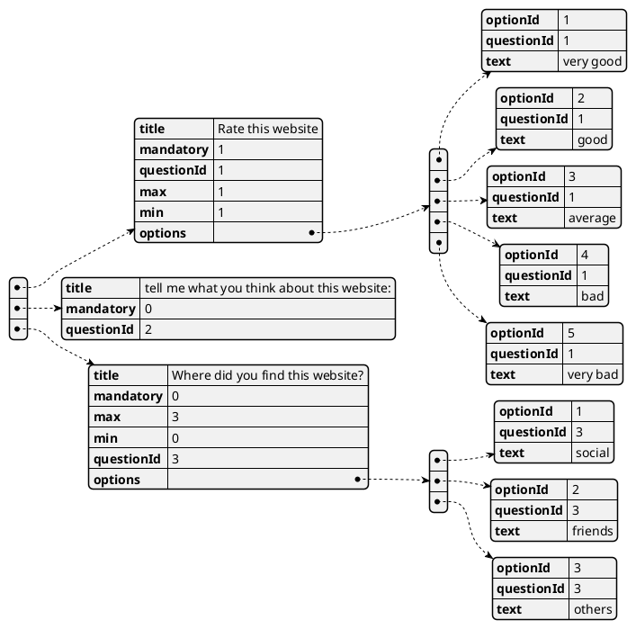
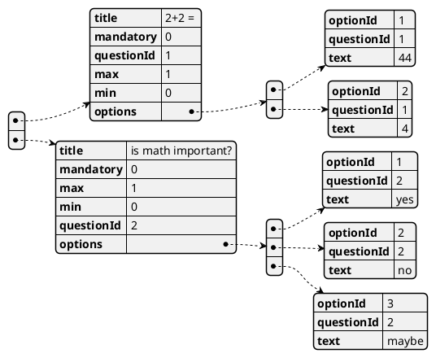
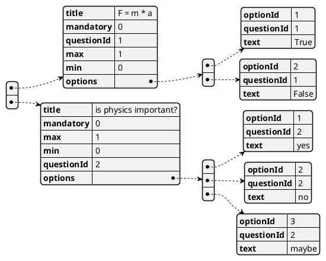
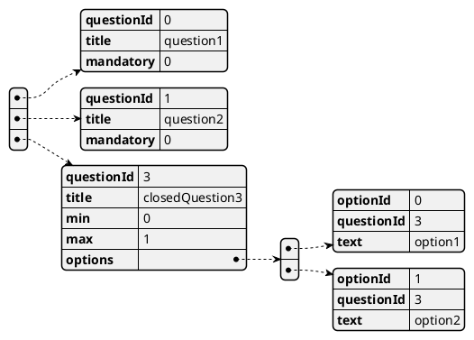
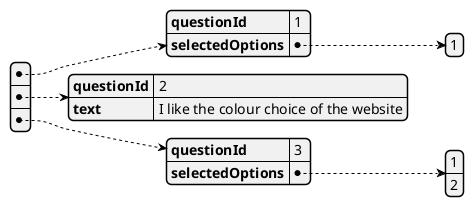
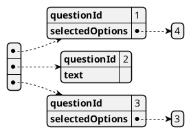
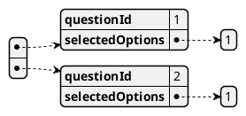
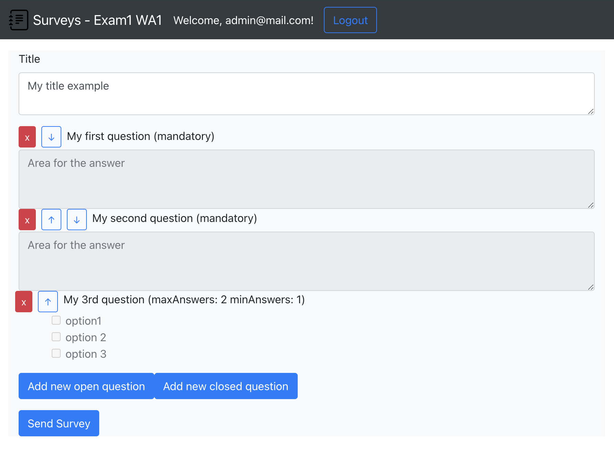

# Exam #1: "Survey"
## Student: s280169 RIOLA MATTIA 

## React Client Application Routes

- Route `/`: page content and purpose
- Route `/something/:param`: page content and purpose, param specification
- ...

## API Server

- POST `/api/login`
  - request parameters and request body content
  - response body content
- GET `/api/something`
  - request parameters
  - response body content
- POST `/api/something`
  - request parameters and request body content
  - response body content
- ...

## Database Tables

- Table `users` - contains user_id email username password

| user_id | email                  | username  | password      |
| ------- | ---------------------- | --------- | ------------- |
| 1       | admin@mail.com         | admin     | password      |
| 2       | riola.mattia@gmail.com | Mattia    | mattia        |
| 3       | teacher@polito.com     | Teacher   | teacher30     |

-----

- Table `surveys` - contains survey_id user_id title questions answers_number

| survey_id | user_id | title                | questions               | answers_number |
| --------- | ------- | -------------------- | ----------------------- | -------------- |
| 1         | 1       | website satisfaction | json object (see below) | 2              |
| 2         | 3       | math quiz            | json object (see below) | 0              |
| 3         | 3       | physics quiz         | json object (see below) | 1              |

  - 'Website satisfaction' `questions` :  

 - 'math quiz' `questions` :

 - 'physics quiz' `questions` :

----

- Table `answers` - contains answer_id survey_id name answers

| answer_id | survey_id | name                   | answers                 |
| --------- | --------- | ---------------------- | ----------------------- |
| 1         | 1         | Mario                  | json object (see below) |
| 2         | 1         | Luigi                  | json object (see below) |
| 3         | 3         | Mattia Riola (s280169) | json object (see below) |

  - 'Mario' `answers` :

 - 'Luigi' `answers` :

 - 'Mattia Riola (s280169) `answers` :

## Main React Components

- `ListOfSomething` (in `List.js`): component purpose and main functionality
- `GreatButton` (in `GreatButton.js`): component purpose and main functionality
- ...

(only _main_ components, minor ones may be skipped)

## Screenshot

## Users Credentials
- username, password (plus any other requested info)
- admin@mail.com, password
- riola.mattia@gmail.com, mattia
- teacher@polito.com, teacher30
